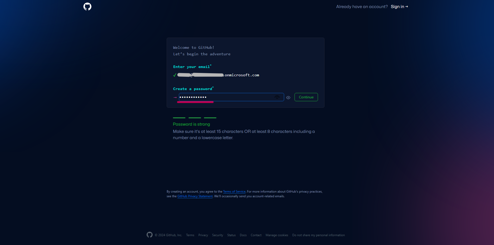
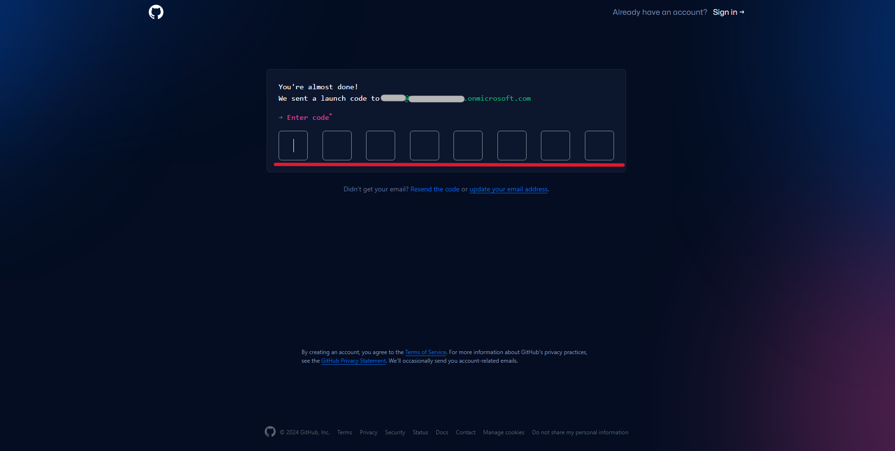
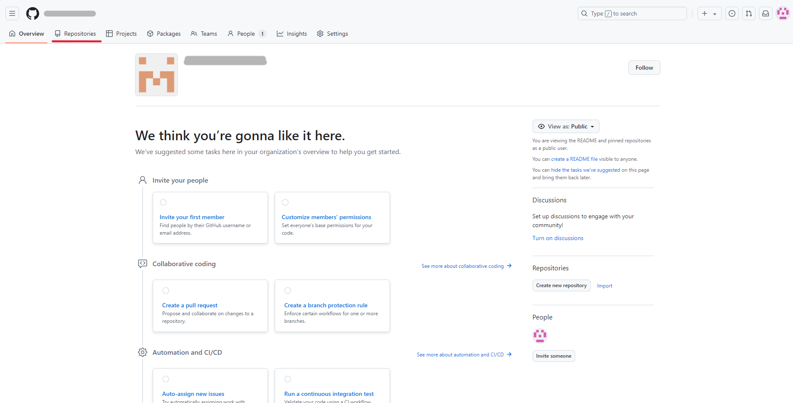
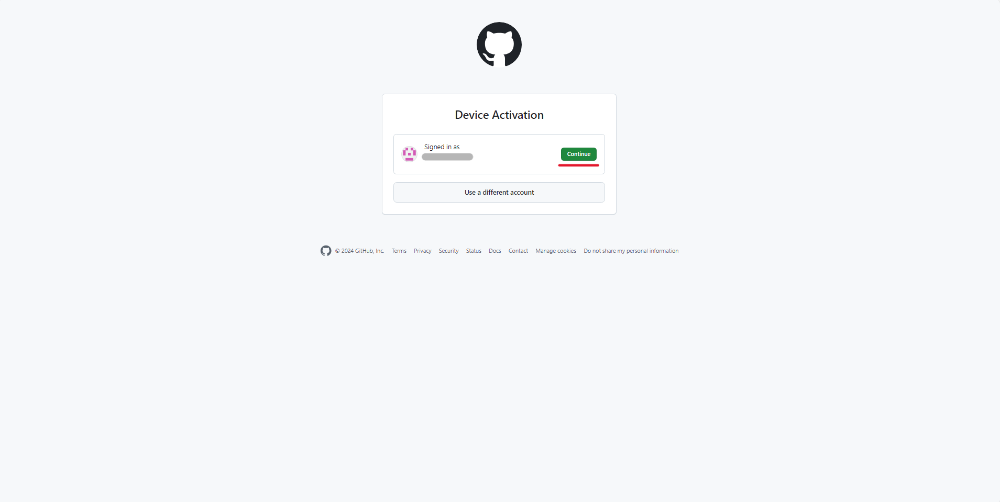
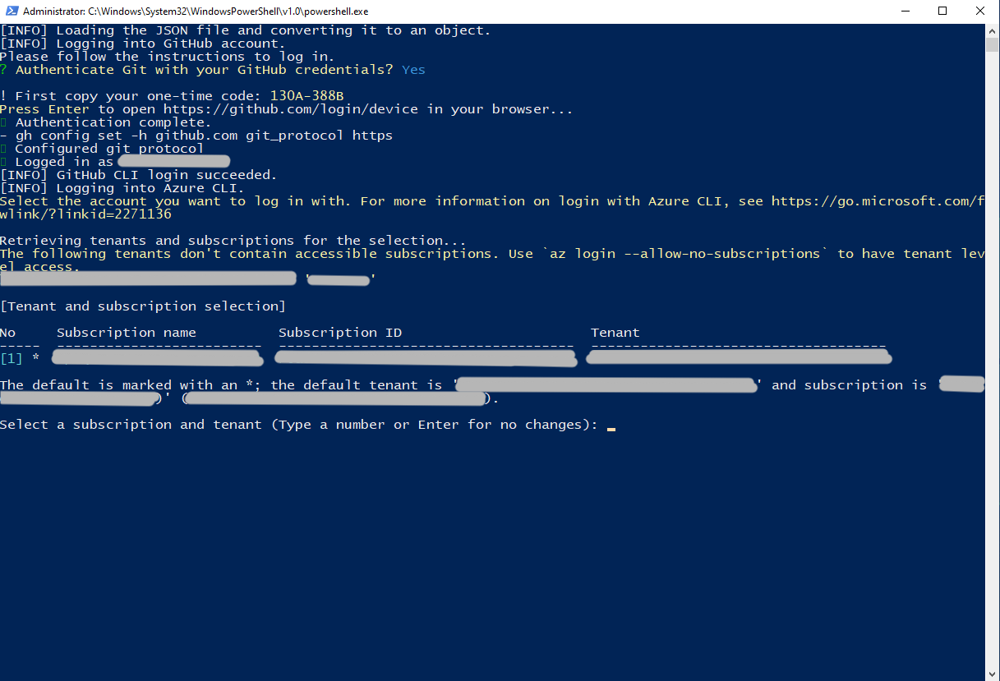
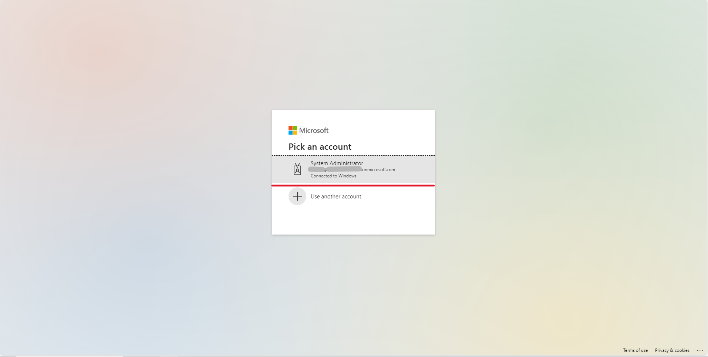
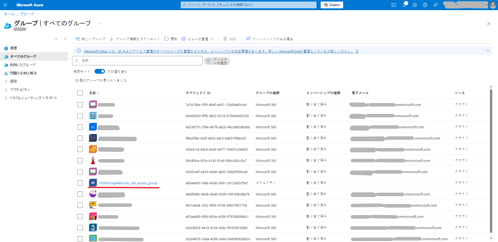

<a name="top"></a>
<div align="right">
  <span style="margin: 0 10px;">GIGAスクールソリューション powered by</span>
  
  <font size="20 "face="Arial"> & </font>
  
</div>

# Microsoft 365 利用状況可視化テンプレート
Microsoft GIGAスクールパッケージの利用状況を蓄積・可視化するためのGitHub Actionsワークフローとレポートの構成サンプルです。  
導入後の端末のMicrosoft 365の利用状況を可視化します。本ドキュメントでは、本プロジェクトの概要や環境構築手順を示します。

## 目次

- [本プロジェクトについて](#-本プロジェクトについて)
- [環境構築](#-環境構築)
- [各レポートの利用方法](#-各レポートの利用方法)
- [参考情報](#-参考情報)

## 🚀 本プロジェクトについて

### 背景

文部科学省の[GIGAスクール構想の実現 学習者用コンピュータ最低スペック基準の一部訂正について（依頼）](https://www.mext.go.jp/content/20240201-mxt_shuukyo01-000033777_01.pdf)には、GIGAスクール構想で普及した端末の利用状況を把握する機能が必要であると記載されています。

> **2.9. 端末の稼働状況を把握できる機能について**
> 
> 本機能は、プライバシー保護に十分留意した上で、端末の利活用状況を客観的に把握するために具備する必要がある（文部科学省による端末の利活用状況の調査において、こうした客観的データに基づく回答を求めることとなる。）...

Microsoft 365 を利用しているテナントについては、Microsoft 365 の利用ログを活用することで端末の利活用状況を把握することができます。  
しかし、Microsoft 365 管理センター上で確認できるログは保管期間が制限されており長期間のログ保管ができません。  
※ 例：Microsoft 365 利用状況レポートのログはMicrosoft 365 管理センター上で最大180日までしか参照できません。

この問題を解決するため、Microsoft 365 の最小のライセンス構成(=A1ライセンス)での利用ログの長期保管や可視化ができる構成サンプルとして本プロジェクトを公開しています。


### 目的

本プロジェクトの目的は以下の通りです。

- **テナント全体のMicrosoft 365 利用ログ蓄積**:  
GIGAスクール構想で導入したMicrosoft 365 テナントの利用状況を文部科学省へ報告する業務が発生する可能性を鑑み、SharePoint Online サイト上で長期的なログの保管を行います。
- **Microsoft 365 利用状況の可視化**:  
蓄積されたログをPower BIを使ってわかりやすく可視化します。


### 概要
Graph APIを用いてMicrosoft 365 の利用ログの収集し、収集したデータをSharePoint Online サイトへアップロードすることで利用ログを蓄積します。  
これらの利用ログの収集・アップロード処理をGitHub Actionsのワークフロー実行によって行い、SharePoint Online サイトに蓄積されたログをPower BIが参照することによって長期的なMicrosoft 365 利用ログの可視化を実現する構成となっています。  

※Microsoft 365 の利用状況レポートのデータがUTC基準の日付で管理されているため、UTC基準で日付が切り替わった後にデータ収集・アップロードを行うワークフローを実行する設計となっています。  
※GitHub Actionsのワークフロー実行は午前10時に設定していますが、実行時刻に数十分程度前後する可能性があります。  
※GitHub Actionsのワークフロー実行後にPower BI による最新データの反映を行う必要があるため、**正午の12時にPower BI による最新データの更新を行います。更新終了後、最新データの閲覧が可能となります。**  

本プロジェクトでは2つの構成を公開していますが、ここではMicrosft 365 A1ライセンスで実現できる構成とレポート画面を例示します。   

**【システム構成図】**


**【レポート画面】**
  ||
  |---------|

<br>

### 👨‍💻👩‍💻 対象者
Microsoft 365 のグローバル管理者アカウントが利用可能なテナントのシステム管理者

<br>

### 🎈 前提条件  
1. **PC**  
セットアップ用のコード実行やPower BI Desktopを利用するため、以下の要件を満たすPCを用意します。  

    | OS | バージョン |
    |:-|:-|
    | Windows 10 | 22H2以降 |
    | Windows 11 | **★Windows 11での動作確認をする** |

2. **ネットワーク**  
資源のインストールやAPI実行を行うため、インターネット接続ができる環境を用意します。  
  
3. **Microsoft 365 ライセンス**  
本プロジェクトのレポートを活用するためには、最低でもMicrosoft 365 A1 ライセンスが必要です。  
また、本プロジェクトが提供するレポートの種別ごとに必要なライセンスが異なります。  
  
    | レポート種別 | 必要なライセンス |
    |:-|:-|
    | [010_テナントの利用状況可視化サンプル](./src/010_テナントの利用状況可視化サンプル/README.md) | Microsoft 365 A1 |
    | [020_学校毎の利用状況可視化サンプル](./src/020_学校毎の利用状況可視化サンプル/README.md)   | Microsoft 365 A1 |
  
4. **Microsoft 365 アカウントおよびグループ**  
本プロジェクトの可視化テンプレートの利用に際しては、本READMEに従ってMicrosoft 365 のログを蓄積するための環境構築が必要です。  
環境構築にはMicrosoft 365 のグローバル管理者アカウントが必要となります。  
また、レポートの種類ごとに以下のアカウントまたはグループが必要となります。  
**★グループの種類について追記する(セキュリティグループ or icrosoft 365 グループ)**

    | レポート種別 | 必要なアカウントまたはグループ |
    |:-|:-|
    | [010_テナントの利用状況可視化サンプル](./src/010_テナントの利用状況可視化サンプル/README.md) | レポートの参照を許可する個別のアカウント。自治体のシステム管理者を想定。 |
    | [020_学校毎の利用状況可視化サンプル](./src/020_学校毎の利用状況可視化サンプル/README.md)   | レポートの参照を許可する個別のアカウント。自治体のシステム管理者を想定。後述する"**M365UsageRecords_site_access_group**"への所属が必要。 |

> [!CAUTION]
> テナント全体のユーザーの利用ログにアクセスするため、教員・児童生徒による本レポートの利用は推奨していません。
  
5. **その他**  
レポートの種類ごとに、前提となる設定や運用に違いがあります。  
    
    | レポート種別 | 想定利用者 | ログ匿名化設定(※1) | 名簿情報の運用(※2)  |
    |:-|:-|:-|:-|
    | [010_テナントの利用状況可視化サンプル](./src/010_テナントの利用状況可視化サンプル/README.md) | 自治体のシステム管理者 | 有効 or 無効 | 無 |
    | [020_学校毎の利用状況可視化サンプル](./src/020_学校毎の利用状況可視化サンプル/README.md)   | 自治体のシステム管理者 | 無効 | 有 |

**※1 ログ匿名化設定**:  
2021年9月1日以降、Microsoft 365 上の利用状況レポートのユーザー識別情報は既定で匿名化されています。  
学校毎の利用状況を集計する場合は、[匿名化をオフにする](https://learn.microsoft.com/ja-jp/microsoft-365/troubleshoot/miscellaneous/reports-show-anonymous-user-name#resolution)必要があります。

**※2 名簿情報の運用**:  
学校毎の利用状況を集計する場合は、Microsoft 365 アカウントごとの学校等の所属情報が必要となります。  
Microsoft 365 テナントによって所属情報の運用方法は異なるため、本プロジェクトでは所属情報の名簿をExcelで作成し、**少なくとも年度ごとに1度は継続的な更新を行っていただく前提としています。**  

<br>

## 📝 環境構築

Microsoft 365利用ログを自動で収集し、SharePointサイトへアップロードする構成をテナントに構築します。 

### 1. 環境構築に必要なツールのインストール

環境構築を行うために、事前に以下に示すツールが必要です。未インストールの場合やバージョンが古い場合は以下の手順でインストールします。
> [!NOTE]
> + 手順の中のスクリーンショットは2024/12/02時点での画面です。現在の画面とは異なる場合がございます。

- Gitのインストール
以下のコードをWindows PowerShellで実行します。  
```shell
winget install --id Git.Git -e --source winget
```
※動作確認済version：2.47.0.windows.2  


コードが実行できなかった場合は[こちら](https://gitforwindows.org/)から.exeファイルをダウンロード後、以下の手順でインストールを行います。

<details>
<summary>クリックして手順を表示　</summary>
    
> 1. ダウンロードした.exeファイルを実行します。
> 2. デフォルトの設定から変更せず、「Install」が表示されるまで「Next」をクリックします。  
> 
> ||
> |---|
> 3. 「Install」をクリックします。
> 
> ||
> |---|
> 4. インストール完了後、以下の画面が表示されるため、「Finish」をクリックします。  
> その後、ブラウザでページが表示されますが、閉じて構いません。
> 
> ||
> |---|
</details>

- GitHub CLIのインストール
以下のコードをWindows PowerShellで実行します。
```shell
winget install --id GitHub.cli
```
※動作確認済version：2.60.1  


コードが実行できなかった場合は、[こちら](https://cli.github.com/)から.msiファイルをダウンロード後、以下の手順でインストールを行います。
<details>
<summary>クリックして手順を表示　</summary>

> 1. ダウンロードした.msiファイルを実行します。
> 2. デフォルトの設定から変更せず、「Install」が表示されるまで「Next」をクリックします。  
> 
> ||
> |---|
> 3. 「Install」をクリックします。  
> 
> ||
> |---|
> 4. インストール完了後、以下の画面が表示されるため「Finish」をクリックします。  
> 
> ||
> |---|
</details>

- Azure CLIのインストール
以下のコードをWindows PowerShellで実行します。
```shell
Invoke-WebRequest -Uri https://aka.ms/installazurecliwindows -OutFile .\AzureCLI.msi
Start-Process msiexec.exe -ArgumentList '/I AzureCLI.msi /quiet' -Wait
```
※動作確認済version：2.65.0   

コードが実行できなかった場合は、[こちら](https://learn.microsoft.com/ja-jp/cli/azure/install-azure-cli-windows?tabs=azure-cli)から.msiファイルをダウンロード後、以下の手順でインストールを行います。  
<details>
<summary>クリックして手順を表示　</summary>

> 1. ダウンロードした.msiファイルを実行します。
> 2. チェックボックスにチェックを入れて、「Install」をクリックします。  
> 
> ||
> |---|
> ||
> 3. インストール完了後、以下の画面が表示されるため、「Finish」をクリックします。  
>
> |)|
> |---|
</details>

### 2. GitHubアカウントの作成
環境構築を行うために、作業者のMicrosoft 365 アカウントと紐づくGitHubアカウントを作成します。
> [!NOTE]
> + 作業者のアカウントと紐づくGitHubアカウントが存在する場合は、"3. GitHub組織の作成"に移動します。

<details>
<summary>クリックして手順を表示　</summary>
  
> 1. [GitHub](https://github.com/)にアクセスします。
> 2. Microsoft 365 アカウントのメールアドレスを入力後、「Sign up for GitHub」をクリックします。
>  
> ||
> |---|
> 3. ユーザー名/パスワードを設定し、「Continue」をクリックします。
> 
> ||
> |---|
> ||
> 4. 「Verify」を押した後、画面の指示通りに認証を行います。
> 
> ||
> |---|
> ||
> 5. 2. で入力したメールアドレスに届く8桁のコードを入力します。
> 
> ||
> |---|
> 6. 画面が切り替わったら、ユーザー名とパスワードを入力して、「Sign in」をクリックします。
> 
> ||
> |---|
> 7. 項目は選択せずに、「Continue」を押して、「Continue for free」を選択します。
> 
> ||
> |---|
> ||
</details>

### 3. GitHub組織の作成
環境構築を行うために、GitHubアカウントと紐づくGitHub組織を作成します。  

<details>
<summary>クリックして手順を表示　</summary>

> 1. GitHubアカウントにログイン後、右上のアイコンを押し、「Your Organization」を選択します。
> 
> ||
> |---|
> ||
> 2. 「New Organization」を押した後に、「Create a free organization」を選択します。
> 
> ||
> |---|
> ||
> 3. 組織名とメールアドレスを入力します。特に指定がない場合は、「My personal account」を選択します。  
> 現在のアカウントではなく、組織のアカウントに紐づける場合は「A business or institution」を選択します。  
> その後、「Verify」をクリックします。
> 
> ||
> |---|
> 4. 画面の指示通りに認証を行います。その後「Next」をクリックします。
> 
> ||
> |---|
> 5. 特に指定がない場合は、「Skip this step」を選択します。  
> メンバーを追加する場合は、メンバーを選択後「Complete setup」をクリックします。
> 以上で新規組織の作成が完了します。
> 
> ||
> |---|
</details>

### 4. GitHub組織のリポジトリの作成
日次でMicrosoft 365 の利用ログの収集やSharePoint Online サイトへのデータアップロードを行うためのGitHub Actionsワークフローを動かすために、GitHubリポジトリの作成を行います。 

<details>
<summary>クリックして手順を表示　</summary>

> 1. GitHubアカウントにログイン後、右上のアイコンを押し、「Your Organization」を選択します。
> 
> ||
> |---|
> ||
> 2. [3. 新規組織の作成]で作成した組織名もしくは、すでに作成済みの組織を選択します。
> 
> ||
> |---|
> 3. 左上のタブから、「Repositories」を選択後、「New repository」をクリックします。
> 
> ||
> |---|
> ||
> 4. リポジトリ名を入力します。「Private」を選択し、「Add a README file」にチェックを入れた後に、「Create repository」をクリックします。以上で、新規リポジトリの作成が完了します。
> 
> ||
> |---|
</details>


### 5.  **GitHubリポジトリの内容をローカルにクローン**  
PowerShellで次のコマンドを任意の場所で実行します。
```shell
git clone https://github.com/{~}/ms-giga-usage-report.git
``` 

### 6. 設定ファイルの編集
ローカルにクローンしたフォルダ内の`params.json`ファイル内の下表の4項目を編集し、上書き保存します。  
`params.json`ファイルは、`ms-giga-usage-report/src/000_setup/params.json`に存在します。
| パラメータ | 設定値 |
|---------|---------|
|githubOrganizationName| GitHubの組織名を入力します。("3. GitHub組織の作成" で設定した組織名)|
|githubRepositoryName|作成したGitHub組織のリポジトリ名を入力します。（"4. GitHub組織のリポジトリの作成" で設定したリポジトリ名）|
|githubAccountName| GitHubアカウント名を入力します。（"2. GitHubアカウントの作成" で設定したアカウント名）|
|githubAccountMail|GitHubアカウントに紐づいているメールアドレスを入力します。（"2. GitHubアカウントの作成" で入力したメールアドレス）|


例) githubOrganizationName="TestOrganization", githubRepositoryName="TestRepository", githubAccountName="testGithubAccountName", githubAccountMail="aaa@contoso.com"の場合  

```json
{
    "githubOrganizationName": "TestOrganization",
    "githubRepositoryName": "TestRepository",
    "githubAccountName": "testGithubAccountName",
    "githubAccountMail": "aaa@contoso.com"
}
```

### 7. デプロイスクリプトの実行 
「5. **GitHubリポジトリの内容をローカルにクローン** 」でローカルにコピーした`ms-giga-usage-report`フォルダ内の`exec.bat`をダブルクリックで実行します。  
`exec.bat`ファイルは、`ms-giga-usage-report/src/000_setup/exec.bat`に存在します。  
※実行に失敗した場合は、`params.json`の内容を確認し`exec.bat`を再実行します。  

<details>
<summary>クリックして手順を表示　</summary>

> - GitHub Cliへのログイン
> 1. PowerShellに以下の画面が表示されたら、Enterをクリックします。
> 
> ||
> |---|
> 2. 画面上の8桁のコードをコピーして、Enterをクリックします。
> 
> ||
> |---|
> 3. 「Continue」を押した後、2でコピーした8桁のコードをペーストし、再び「Continue」をクリックします。
> 
> ||
> |---|
> ||
> 4. 「Authorize github」をクリックします。その後、パスワードの入力が求められた場合は、パスワードを入力します。
> 
> ||
> |---|
> 5. 以下の画面が表示されたら、GitHub CLIへのログインが完了します。
> 
> ||
> |---|
> 
> - Azureアカウントへのログイン
> 1. 以下のポップアップが表示されたら、自分のMicrosoftアカウントを選択し、「Continue」をクリックします。その後、パスワードの入力が求められた場合は、パスワードを入力します。
> 
> ||
> |---|
> 2. PowerShellのコンソールが以下の画面になったら、Enterをクリックします。
> 
> ||
> |---|
> 
> - Microsoft Graphへのログイン
> 1. ブラウザが立ち上がり、以下の画面が表示されるため、自分のMicrosoftアカウントを選択します。その後、パスワードの入力が求められた場合は、パスワードを入力します。
> 
> ||
> |---|
> 2. 以下の画面が表示されたら、Microsoft Graphアカウントへのログインは完了です。
> 
> ||
> |---|
>
> - SharePoint Online管理シェルへのログイン
> 1. 以下のポップアップが表示されたら、自分のMicrosoftアカウントを選択します。その後、パスワードの入力が求められた場合は、パスワードを入力します。
> 
> ||
> |---|
</details>


### 8. 動作確認
SharePoint Online サイトにMicrosoft 365 利用ログが出力されているかを以下の手順で確認します。  
データが正しく出力されていない場合は、`params.json`の設定を再確認します。

<details>
<summary>クリックして手順を表示　</summary>

> 1. SharePoint Onlineサイトにアクセスします。  
> URLは以下になります。（`output.json`ファイル内の"siteUrl"に記載）  
> **「https://{テナントドメイン}.sharepoint.com/sites/M365UsageRecords」**
> 
> 2. 左側のタブから、「ドキュメント」を選択します。
> 
> ||
> |---|
> 3. 「**M365UsageRecords/M365UsageReports/{"Concealed" or "UnConcealed"}/M365AppUserDetail/school_year={現在の年度}**」
> を確認し、csvファイルが存在することを確認します。  
</details>

### 9. アクセス権設定  
これまでの構築作業で、Microsoft 365 の利用ログや現在Entra ID上に登録されているユーザー情報がSharePoint Onlineサイト上に追加されるようになりました。  
しかし、他のユーザーがPower BIのレポートを閲覧する場合は以下の手順による権限設定が必要です。  

<details>
<summary>アクセス権設定作業 　</summary>

> 1.  [Azure Portal](https://portal.azure.com/)にログインします。
>
> 2. Azure サービスから、「Microsoft Entra ID」を選択します。
>
> ||
> |---|
>
> 3. 左側のタブから、「グループ > すべてのグループ」を選択します。
>
> ||
> |---|
> ||
>
> 4. グループの中から、"**M365UsageRecords_site_access_group**"を選択します。
>
> ||
> |---|
>
> 5. 左側の「管理」タブを展開し、「メンバー」を選択します。
>
> ||
> |---|
> ||
> 
> 6. 上側の「メンバーの追加」を選択し、レポートを参照するユーザーを追加します。  
> 以上で、アクセス権の設定作業は完了です。
>
> ||
> |---|

</details>

> [!NOTE]
> + 環境構築したユーザー以外がレポートを利用する場合のみ実施する。

> [!CAUTION]
> 本グループは、テナントのシステム管理者のみ所属することを前提にしているため、追加したメンバーはMicrosoft 365 テナントのすべてのアカウントの利用ログやユーザー情報を閲覧できる状態になります。  
> ※Power BIレポート上では学校ごとの集計値のみ表示されていますが、データソースとなるSharePoint Onlineサイトへアクセスすると全ユーザーの利用ログが参照できる状態となります。  
> そのため、**テナントのシステム管理者のみに対してアクセス権を付与(グループへの追加)することを強く推奨します。**

## 📃 各レポートの利用方法

前提条件別に以下のレポートを公開しています。リンク先の手順に従ってそれぞれ利用方法を確認します。
- [010_テナントの利用状況可視化サンプル](./src/010_テナントの利用状況可視化サンプル/README.md)
- [020_学校毎の利用状況可視化サンプル](./src/020_学校毎の利用状況可視化サンプル/README.md)  
※利用のためには各Microsot 365 IDがどの学校に所属しているのかを示す名簿ファイルの作成が必要

<br>

## 📚 参考情報

本プロジェクトに関連するドキュメントはこちらです。
- [GIGA スクール構想の実現 学習者用コンピュータ最低スペック基準の一部訂正について（依頼）](https://www.mext.go.jp/content/20240201-mxt_shuukyo01-000033777_01.pdf)
- [Microsoft 365 レポートに実際のユーザー名ではなく匿名のユーザー名が表示される -Microsoft 365](https://learn.microsoft.com/ja-jp/microsoft-365/troubleshoot/miscellaneous/reports-show-anonymous-user-name#resolution)
- [Git for Windows](https://gitforwindows.org/)
- [GitHub Cli](https://cli.github.com/)
- [Windows での Azure CLI のインストール](https://learn.microsoft.com/ja-jp/cli/azure/install-azure-cli-windows?tabs=azure-cli)

ご覧いただき、ありがとうございます。

[Back to top](#top)
