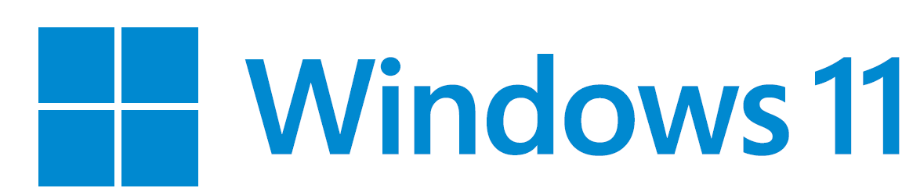

<a name="top"></a>
<div align="right">
  <span style="margin: 0 10px;">GIGAスクールソリューション powered by</span>
  
  <font size="20 "face="Arial"> & </font>
  
</div>

# Microsoft 365 利用状況可視化テンプレート

Microsoft GIGAスクールパッケージ導入後の端末におけるMicrosoft 365 の利用状況の蓄積・可視化を実現するためのレポートサンプルです。


## 目次

- [本プロジェクトについて](#-本プロジェクトについて)
- [初期設定](#-初期設定)
- [各レポートの利用方法](#-各レポートの利用方法)
- [関連情報](#-関連情報)

<br>

## 🚀 本プロジェクトについて

### 背景

文部科学省の[GIGAスクール構想の実現 学習者用コンピュータ最低スペック基準の一部訂正について（依頼）](https://www.mext.go.jp/content/20240201-mxt_shuukyo01-000033777_01.pdf)には、GIGAスクール構想で普及した端末の利用状況を把握する機能が必要であると記載されています。

> **2.9. 端末の稼働状況を把握できる機能について**
> 
> 本機能は、プライバシー保護に十分留意した上で、端末の利活用状況を客観的に把握するために具備する必要がある（文部科学省による端末の利活用状況の調査において、こうした客観的データに基づく回答を求めることとなる。）...

Microsoft 365 を利用しているテナントについては、Microsoft 365 の利用ログを活用することで端末の利活用状況を把握することができると考えましたが、Microsoft 365 管理センター上で確認できるログは保管期間が制限されており長期間のログ保管ができません。  
※ 例：Microsoft 365 利用状況レポートのログはMicrosoft 365 管理センター上で最大180日までしか参照できません。

この問題を解決するため、Microsoft 365 の最小のライセンス構成(=A1ライセンス)での利用ログの長期保管や可視化ができる構成サンプルとして本プロジェクトを公開しています。


### 目的

本プロジェクトの目的は以下の通りです。

- **テナント全体のMicrosoft 365 利用ログ蓄積**:  
  GIGAスクール構想で導入したMicrosoft 365 テナントの利用状況を文部科学省に報告する必要がある可能性があるため、SharePoint Online サイト上で長期的なログの保管を行います。
- **Microsoft 365 利用状況の可視化**:  
  蓄積されたログをPower BIを使って視覚的にわかりやすく可視化します。

<br>

### 概要

Graph APIを用いてMicrosoft 365 の利用ログの収集し、収集したデータをSharePoint Online サイトへアップロードすることで利用ログを蓄積します。  
これらの利用ログの収集・アップロード処理をGitHub Actionsのワークフロー実行によって行い、SharePoint Online サイトに蓄積されたログをPower BIが参照することによって長期的なMicrosoft 365 利用ログの可視化を実現する構成となっています。  

※Microsoft 365 の利用状況レポートのデータがUTC基準の日付で管理されているため、UTC基準で日付が切り替わった後にデータ収集・アップロードを行うワークフローを実行する設計となっています。  
※GitHub Actionsのワークフロー実行は午前10時に設定していますが、実行時刻に数十分程度前後する可能性があります。  
※GitHub Actionsのワークフロー実行後にPower BI による最新データの反映を行う必要があるため、**正午の12時にPower BI による最新データの更新を行います。更新終了後、最新データの閲覧が可能となります。**  

本プロジェクトでは2つの構成を公開していますが、ここではMicrosft 365 A1ライセンスで実現できる構成とレポート画面を例示します。   

**【システム構成図】**


**【レポート画面】**
||
|---------|

<br>

### 🎈 前提条件  
1. **PC**  
セットアップ用のコード実行やPower BI Desktopを利用するため、以下の要件を満たすPCを用意してください。  

    | OS | バージョン |
    |:-|:-|
    | Windows 10 | 22H2以降 |
    | Windows 11 | **★Windows 11での動作確認をする** |
  
      
3. **ネットワーク**  
資源のインストールやAPI実行を行うため、インターネット接続ができる環境を用意してください。  
  
4. **Microsoft 365 ライセンス**  
本プロジェクトのレポートを活用するためには、最低でもMicrosoft 365 A1 ライセンスが必要です。  
また、本プロジェクトが提供するレポートの種別ごとに必要なライセンスが異なります。    
  
    | レポート種別 | 必要なライセンス |
    |:-|:-|
    | [010_テナントの利用状況可視化サンプル](./src/010_テナントの利用状況可視化サンプル/README.md) | Microsoft 365 A1 |
    | [020_学校毎の利用状況可視化サンプル](./src/020_学校毎の利用状況可視化サンプル/README.md)   | Microsoft 365 A1 |
  
5. **Microsoft 365 アカウントおよびグループ**  
本プロジェクトの利用に際しては、本READMEに従ってMicrosoft 365 のログを蓄積するための初期設定が必要です。  
初期設定にはMicrosoft 365 のグローバル管理者アカウントをご用意ください。  
また、レポートの種類ごとに以下のアカウントまたはグループもご用意ください。  
**★グループの種類について追記する(セキュリティグループ or icrosoft 365 グループ)**

    | レポート種別 | 必要なアカウントまたはグループ |
    |:-|:-|
    | [010_テナントの利用状況可視化サンプル](./src/010_テナントの利用状況可視化サンプル/README.md) | レポートの参照を許可する個別のアカウント。自治体のシステム管理者を想定。 |
    | [020_学校毎の利用状況可視化サンプル](./src/020_学校毎の利用状況可視化サンプル/README.md)   | レポートの参照を許可する個別のアカウント。自治体のシステム管理者を想定。後述する"**M365UsageRecords_site_access_group**"への所属が必要。 |

  > [!CAUTION]
  > テナント全体のユーザーの利用ログにアクセスするため、教員・児童生徒による本レポートの利用は推奨していません。
  
5. **その他**  
レポートの種類ごとに、前提となる設定や運用に違いがあります。  
    
    | レポート種別 | 想定利用者 | ログ匿名化設定(※1) | 名簿情報の運用(※2)  |
    |:-|:-|:-|:-|
    | [010_テナントの利用状況可視化サンプル](./src/010_テナントの利用状況可視化サンプル/README.md) | 自治体のシステム管理者 | 有効 or 無効 | 無 |
    | [020_学校毎の利用状況可視化サンプル](./src/020_学校毎の利用状況可視化サンプル/README.md)   | 自治体のシステム管理者 | 無効 | 有 |

    **※1)ログ匿名化設定**:  
    2021年9月1日以降、Microsoft 365 上の利用状況レポートのユーザー識別情報は既定で匿名化されています。  
    学校毎の利用状況を集計する場合は、[匿名化をオフにする](https://learn.microsoft.com/ja-jp/microsoft-365/troubleshoot/miscellaneous/reports-show-anonymous-user-name#resolution)必要があります。
  
    **※2)名簿情報の運用**:  
    学校毎の利用状況を集計する場合は、Microsoft 365 アカウントごとの学校等の所属情報が必要となります。  
    Microsoft 365 テナントによって所属情報の運用方法は異なるため、本プロジェクトでは所属情報の名簿をExcelで作成し、**少なくとも年度ごとに1度は継続的な更新を行っていただく前提としています。**  

<br>

## 📝 初期設定

### 👨‍🎓 対象者
「初期設定」の手順については、Microsoft 365 テナントを管理している人に向けたものです。  
※作業を行うにはMicrosoft 365 のグローバル管理者アカウントが必要です  

<br>

### 手順①: (必要に応じて)環境構築に必要なツールのインストール

環境構築を行うために以下のツールが必要です。未インストールの場合は以下の手順でインストールしてください。

- **Gitのインストール**

  以下のコードをWindows PowerShellで実行するか、[こちら](https://gitforwindows.org/)の手順に従ってインストールしてください。
  ```shell
  winget install --id Git.Git -e --source winget
  ```
  ※動作確認済version：2.47.0.windows.2  

- **GitHub CLIのインストール**

  以下のコードをWindows PowerShellで実行するか、[こちら](https://cli.github.com/)の手順に従ってインストールしてください。
  ```shell
  winget install --id GitHub.cli
  ```
  ※動作確認済version：2.60.1  

- **Azure CLIのインストール**

  以下のコードをWindows PowerShellで実行するか、[こちら](https://learn.microsoft.com/ja-jp/cli/azure/install-azure-cli-windows?tabs=azure-cli)の手順に従ってインストールしてください。
  ```shell
  Invoke-WebRequest -Uri https://aka.ms/installazurecliwindows -OutFile .\AzureCLI.msi
  Start-Process msiexec.exe -ArgumentList '/I AzureCLI.msi /quiet' -Wait
  ```
  ※動作確認済version：2.65.0  

- **GitHubアカウントと組織の作成**
  1. [GitHub](https://github.com/)にアクセス
  2. サインアップをクリックしてアカウントを作成
  3. 「Your Organization」から新規組織を作成

<br>

### 手順②: 環境構築

Microsoft 365 利用ログを自動で収集し、SharePointサイトへアップロードする構成をテナントに構築します。  


1. **リポジトリの作成**  
   GitHub上でプライベートリポジトリを作成します。  
   「Your Organization > {組織名} > repository > New repository」から作成してください。  
   ※**必ず"Private"を選択**し、**"Add a README file"にチェック**を付けてください。

2. **GitHubリポジトリの内容をローカルにクローン**  
   PowerShellで次のコマンドを任意の場所で実行してください。

   ```shell
   git clone https://github.com/ntc-uchida-co-jp/ms-giga-usage-report.git
   ``` 

3. **設定ファイルの編集**  
  ローカルにクローンしたフォルダ内の`params.json`ファイル内の項目を編集し、上書き保存してください。  
  "Organization name": GitHubの組織名を入力してください。  
  "Repository name": 作成したGitHub組織のリポジトリ名を入力してください。  
  "githubAccountName": GitHubアカウント名を入力してください。  
  "githubAccountMail": GitHubアカウントに紐づいているメールアドレスを入力してください。  
  
    例) Organization name = "TestOrganization", Repository name = "TestRepository", githubAccountName = "testGithubAccountName", githubAccountMail = "aaa@contoso.com"の場合  
    ```json
    {
        "githubOrganizationName": "TestOrganization",
        "githubRepositoryName": "TestRepository",
        "githubAccountName": "testGithubAccountName",
        "githubAccountMail": "aaa@contoso.com"
    }
    ```

4. **デプロイスクリプトの実行**  
   「2. **GitHubリポジトリの内容をローカルにクローン** 」でローカルにコピーした"ms-giga-usage-report"フォルダ内の"exec.bat"をダブルクリックで実行してください。  
   ※認証や入力を求められた場合は指示に従ってください。
   ※実行に失敗した場合は、"exec.bat"を再実行してください。

5. **動作確認**  
   数分後、SharePoint Onlineサイトにデータが出力されているか確認してください。データが正しく出力されていない場合は、設定を再確認してください。  
   SharePoint OnlineサイトのURLは以下になります。（`output.json`ファイル内の"siteUrl"に記載）  
   
   **https://{テナントドメイン}.sharepoint.com/sites/M365UsageRecords**

<br>

### 手順③: (必要に応じて)アクセス権設定  

"手順②: 環境構築"で、Microsoft 365 の利用ログや現在Entra ID上に登録されているユーザー情報などがSharePointサイト上に追加されるようになりました。  
しかし、他のユーザーがPower BIのレポートを閲覧する場合は以下の手順による権限設定が必要です。  
※初期設定実施者のみが[010_テナントの利用状況可視化サンプル](./src/010_テナントの利用状況可視化サンプル/README.md)や[020_学校毎の利用状況可視化サンプル](./src/020_学校毎の利用状況可視化サンプル/README.md)を利用する場合は、作業の必要はございません。  


#### アクセス権設定作業 
  1. [Azure Portal](https://portal.azure.com/)にログインし、Microsoft Entra IDを開く。  
  2. 「グループ > すべてのグループ」から、"**M365UsageRecords_site_access_group**"を選択する。  
  3. 「メンバー > メンバーの追加」から、レポートを参照するユーザーを追加する。
  > [!CAUTION]
  > 本グループは、テナントのシステム管理者のみ所属することを前提にしているため、追加したメンバーはMicrosoft 365 テナントのすべてのアカウントの利用ログやユーザー情報を閲覧できる状態になります。  
  > ※Power BIレポート上では学校ごとの集計値のみ表示されていますが、データソースとなるSharePoint Onlineサイトへアクセスすると全ユーザーの利用ログが参照できる状態となります。  
  > そのため、**テナントのシステム管理者のみに対してアクセス権を付与(グループへの追加)することを強く推奨します。**

<br>

## 📃 各レポートの利用方法

前提条件別に以下3種のレポートを公開しています。リンク先の手順に従ってそれぞれ利用してください。

- [010_テナントの利用状況可視化サンプル](./src/010_テナントの利用状況可視化サンプル/README.md)
- [020_学校毎の利用状況可視化サンプル](./src/020_学校毎の利用状況可視化サンプル/README.md)  
   ※利用のためには各Microsot 365 IDがどの学校に所属しているのかを示す名簿ファイルの作成が必要

<br>

## 📚 関連情報

本プロジェクトに関連するドキュメントはこちらです。

- [GIGA スクール構想の実現 学習者用コンピュータ最低スペック基準の一部訂正について（依頼）](https://www.mext.go.jp/content/20240201-mxt_shuukyo01-000033777_01.pdf)
- [Microsoft 365 レポートに実際のユーザー名ではなく匿名のユーザー名が表示される -Microsoft 365](https://learn.microsoft.com/ja-jp/microsoft-365/troubleshoot/miscellaneous/reports-show-anonymous-user-name#resolution)
- [Git for Windows](https://gitforwindows.org/)
- [GitHub Cli](https://cli.github.com/)
- [Windows での Azure CLI のインストール](https://learn.microsoft.com/ja-jp/cli/azure/install-azure-cli-windows?tabs=azure-cli)

ご覧いただき、ありがとうございます。

[Back to top](#top)
