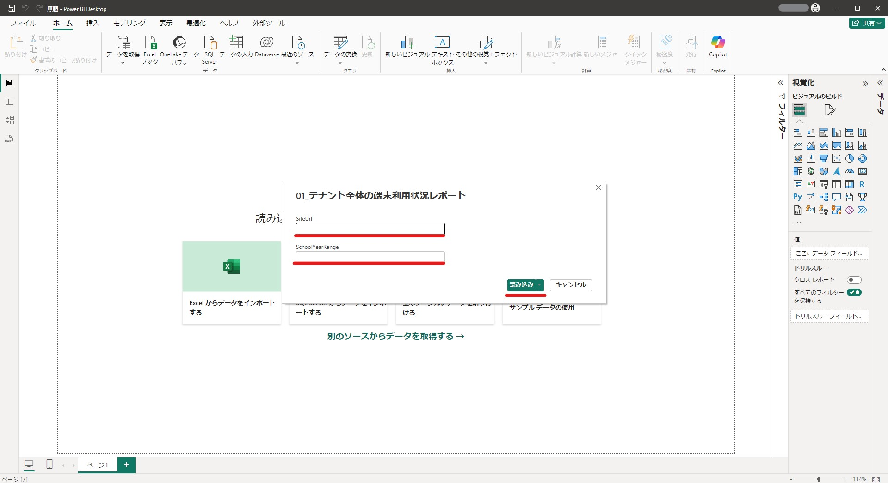
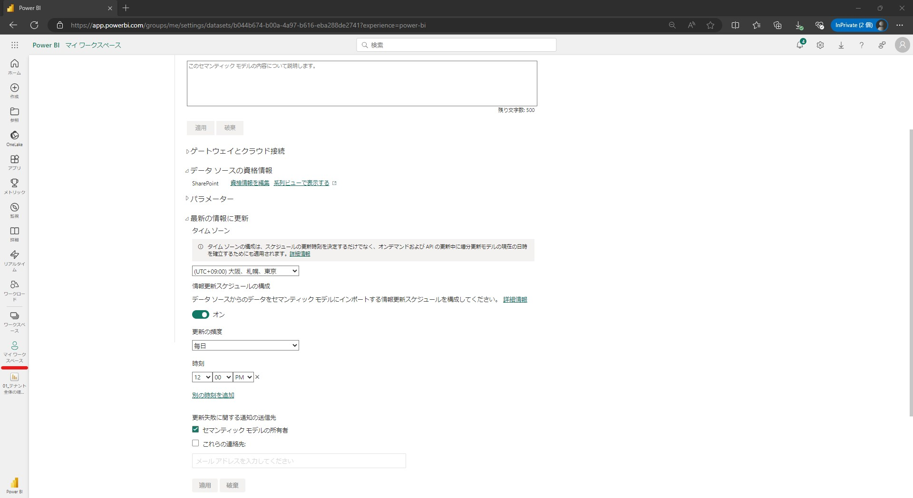

# Microsoft 365 テナント全体の利用状況可視化サンプル利用ガイド

Microsoft 365 テナント全体の利用状況可視化サンプルのPBITファイルのセットアップと利用方法を解説します。

## 目次

- [対象者](#-対象者)
- [概要](#-概要)
- [前提条件](#-前提条件)
- [事前準備](#-事前準備)
- [利用開始手順](#-利用開始手順)
- [取得データ期間の変更方法](#-取得データ期間の変更方法)
- [関連情報](#-関連情報)

## 👨‍💻👩‍💻 対象者

本ガイドは、Microsoft 365 テナント全体の利用状況可視化サンプルを閲覧するユーザーが対象です。  
主な利用者はシステム管理者を想定しています。

## 💻 概要

テナント全体のMicrosoft 365 の利用状況を可視化します。  
利用日数に応じて区分された利用人数および利用率を集計します。

**【システム構成図】**

**【レポート画面】**
||
|---------|

## ✅ 前提条件

Microsoft 365 テナント全体の利用状況可視化サンプルを使用するには以下の前提条件を満たす必要があります。
 
1. **Microsoft 365 アカウント**  
   Power BI Desktop や Power BI サービスにサインインするための有効な Microsoft 365 アカウントが必要です。

2. **Microsoft 365 A1ライセンス**  
   本プロジェクトのレポートを活用するためには、最低でもMicrosoft 365 A1ライセンスが必要です。  

3. **インターネット接続**  
   Power BI Desktop からデータソースとなる SharePoint Online へのアクセスやPower BI サービスのアクセスにインターネット接続が必須です。

4. **Power BI Desktop のインストール**  
   PCに Power BI Desktop がインストールされていることを確認してください。  
   詳細は[こちら（Power BI Desktop の取得 - Power BI | Microsoft Learn）](https://learn.microsoft.com/ja-jp/power-bi/fundamentals/desktop-get-the-desktop)の手順に従ってください。  

> [!NOTE]
> + Power BI Desktop のインストールにはPCの管理者権限が必要になる場合があります。
> + Power BI Desktop の起動後、「WebView2に問題があります」と表示された場合は以下のMicrosoft Learnを参考にしてください。
>   [Power BI Desktop の起動に関する問題を解決する - Power BI | Microsoft Learn](https://learn.microsoft.com/ja-jp/power-bi/connect-data/desktop-error-launching-desktop)

6. **データソースへのアクセス権**  
   SharePoint Online サイト上のデータソースへのアクセス権限を持っていることを確認してください。

## 📥 事前準備

### 1. GitHubからのPBITファイルのダウンロード

レポートを利用開始するために、以下の手順でテンプレートをダウンロードできます。

　クリックして詳細表示　★残対応有り

> 1. [本件のマスタリポジトリ](01_テナント全体の端末利用状況レポート.pbit) にアクセスし、対象のPBITファイルをダウンロードします。★画像 リンク調整

### 2. Power BI サービスへのサインイン

初回利用時には、Power BI サービスにサインインする必要があります。

　クリックして詳細表示

> 1. 以下のWebページにアクセスします。  
>    [始める | Microsoft Power BI](https://www.microsoft.com/ja-jp/power-platform/products/power-bi/getting-started-with-power-bi)
> 
> 2. 右上の [サインイン] からPower BI サービスにサインインします。  
> 
> ||
> |---------|
> 
> 3. 画面の指示に従いメールアドレスを入力して [送信] します。
> 
> ||
> |---------|
> ||

### 3. 「Microsoft Fabric Free」ライセンスの有効化

Microsoft 365 A1 / A3 ライセンスの場合は、「Microsoft Fabric Free」ライセンスを有効化する必要があります。

> [!NOTE]
> + Microsoft 365 A5 ライセンスには「Power BI Pro」ライセンスが含まれるため、こちらの手順は不要です。
> + 詳細手順のような画面が表示されない場合もこちらの手順は不要です。
> + Microsoft Fabric の「無料試用版」を有効化する必要はありません。

　クリックして詳細表示

> 1. サービス画面上の指示に従い、「Microsoft Fabric Free」ライセンスを開始します。
> 
> ||
> |---------|
> ||
> ||
> 
> 2. Power BI サービスが開きます。右上の「人アイコン」をクリックし、  
>    「ライセンスの種類：無料アカウント」と表示されていることを確認します。
> 
> ||
> |---------|

## 📝 利用開始手順

### 1. PBITファイルの利用開始

以下の手順に従い、テンプレートをPower BI Desktop で開きます。

> [!NOTE]
> + 不具合が生じた場合は「前提条件　Power BI Desktop のインストール」を参照してください。

　クリックして詳細表示

> 1. 事前準備でダウンロードしたPBITファイルをダブルクリックし、Power BI Desktop で開きます。  
> 
> ||
> |---------|
> 
> 2. サインインを求められたら、自身のMicrosoft 365 アカウントでサインインします。
> 
> ||
> |---------|

### 2. パラメータの設定とデータソースの設定

テンプレートを設定しデータソースに接続できるようにします。

　クリックして詳細表示　★残対応有り

> 1. PBITファイルを開くと、以下のパラメータ設定を求められます。以下の情報を入力してください。
> 
> | パラメータ | 設定値 |
> |---------|---------|
> |SiteUrl| 利用者環境リポジトリ内の [outputs.json](../000_setup/outputs.json) に記載されている [siteUrl] の値|
> |SchoolYearRange|3|
> 
> - **SiteUrl**：データソースファイルが格納されているSharePoint Online サイトのURLを入力します。  
> - **SchoolYearRange**：取得するデータ期間の年度数を1以上の整数で入力します。  
>  ※ここでは「SchoolYearRange」を既定の 3 に設定します。   
>  ※本システム運用開始以前のデータは取得できません。  
> 
> ||
> |---------|
> 
> 2. データソースの資格情報設定を求められます。 [Microsoft アカウント] > [サインイン] をクリックし、サインインします。
> 
> ||
> |---------|
> ||
> ||
> 
> 3. サインインが完了したら、 [接続] をクリックします。
> 
> ||
> |---------|
> 
> 4. データの読込が始まり、しばらくするとレポート画面が表示されます。  
>    ★この時点では26日分？しかデータが無いためすぐに終わるはず  
> 
> ||
> |---------|

### 3. レポートの保存

レポートを保存します。

　クリックして詳細表示

> 1. [ファイル] タブをクリックします。
> 
> ||
> |---------|
> 
> 2.  [名前を付けて保存] > [このデバイスを参照する] をクリックします。
> 
> ||
> |---------|
> 
> 3.  ファイル名を入力し、適当な保存場所を選択して [保存] をクリックします。
> 
> | 設定項目 | 設定値 |
> |---------|---------|
> |ファイル名|01_テナント全体の端末利用状況レポート|
> |ファイルの種類|Power BI ファイル (*.pbix)|
> 
> ||
> |---------|

### 4. マイワークスペースへの発行

ブラウザでレポートを閲覧するために、Power BI サービスのマイワークスペースにレポートを発行します。  

　クリックして詳細表示

> 1. [ホーム] タブから [発行] をクリックします。
> 
> ||
> |---------|
> 
> 2. 「マイワークスペース」を選択し、 [選択] をクリックして発行を開始します。
> 
> ||
> |---------|
> 
> 3. 発行が完了したら、 [Power BI で '01_テナント全体の端末利用状況レポート' を開く] をクリックします。
> 
> ||
> |---------|
> 
> 4. ブラウザが立ち上がり、Power BI サービスでレポートが開かれることを確認します。
> 
> ||
> |---------|

### 5. データソース資格情報の設定

マイワークスペースに発行後、Power BI サービスからデータを更新するために資格情報を設定する必要があります。  
以下の手順に従って設定してください。

　クリックして詳細表示

> 1. Power BI サービスの左側メニューから [マイワークスペース] を選択します。
> 
> ||
> |---------|
> 
> 2. 発行したセマンティックモデルの [・・・] > [設定] をクリックし、設定画面を開きます。
> 
> ||
> |---------|
> 
> 3. [データソースの資格情報] セクションの [資格情報を編集] をクリックします。
> 
> ||
> |---------|
> 
> 4. 設定項目を以下に設定し [サインイン] をクリックします。
> 
> | 設定項目 | 設定値 |
> |---------|---------|
> |認証方法|OAuth2|
> |このデータ ソースのプライバシー レベルの設定|Private|
> 
> ||
> |---------|
> 
> 5. 自身のアカウントをクリックします。
> 
> ||
> |---------|
> 
> 6. 資格情報が設定されます。次の手順で引き続き設定を行うため、設定画面はそのまま開いておきます。
> 
> ||
> |---------|

### 6. データの自動更新設定

レポートで最新の情報を確認するためにデータの自動更新を設定する必要があります。  
以下の手順に従って設定してください。

> [!NOTE]
> + データ蓄積機能で最新データを取得するタイミングに合わせたスケジュール設定になります。

　クリックして詳細表示

> 1. （前の手順に引き続き、）セマンティックモデルの設定画面を開きます。
> 2. [最新の情報に更新] セクションからスケジュール設定を行います。設定値は以下を参照してください。
> 
> | 設定項目 | 設定値 |
> |---------|---------|
> |タイムゾーン|(UTC+09:00)大阪、札幌、東京|
> |情報更新スケジュールの構成|オン|
> |更新の頻度|毎日|
> |時刻|12:00PM|
> 
> ||
> |---------|
> 
> 3. [適用] をクリックして、設定を保存します。
> 
> ||
> |---------|

### 7. データ取得の動作確認

Power BI サービスでデータの手動更新を行い、データ取得の動作確認を実施します。  

　クリックして詳細表示　★残対応有り

> 1. マイワークスペースを開きます。
> 
> ||
> |---------|
> 
> 2. データソースの資格情報を設定したセマンティックモデルを選択し、更新マーク（🔄）をクリックします。
> 
> ||
> |---------|
> 
> 4. 「最新の情報に更新済み」の日時が更新されたら完了です。
>    ※★分程度かかります。
> 
> ||
> |---------|

## 🔄 取得データ期間の変更方法

### 1. パラメータの変更

マイワークスペースに発行後、取得するデータ期間の年度数を変更する場合は、以下の手順に従って設定してください。

> [!NOTE]
> + システム性能の都合上、データ期間の年度数は上限「9」を目安に設定して下さい。

　クリックして詳細表示

> 1. Power BI サービスの左側メニューから [マイワークスペース] を選択します。
> 
> ||
> |---------|
> 
> 2. セマンティックモデルの [・・・] > [設定] をクリックし、設定画面を開きます。
> 
> ||
> |---------|
> 
> 3. [パラメーター] セクションから SchoolYearRange を任意の値に変更します。  
> 
> ||
> |---------|
> 
> 4. 適用して設定を保存します。
> 
> ||
> |---------|
> 
> 5. 変更後のパラメータでデータを取得する場合は、上述の「利用開始手順 7. データ取得の動作確認」を実施してください。

## 📚 関連情報

本プロジェクトに関連するドキュメントはこちらです。

- [Power BI Desktop と Power BI サービスの比較 - Power BI | Microsoft Learn](https://learn.microsoft.com/ja-jp/power-bi/fundamentals/service-service-vs-desktop)
- [Power BI Desktop のインストールガイド（Power BI Desktop の取得 - Power BI | Microsoft Learn）](https://learn.microsoft.com/ja-jp/power-bi/fundamentals/desktop-get-the-desktop)

ご覧いただき、ありがとうございます。GIGAスクール構想で導入した端末の利用状況把握に少しでもお役立ていただければ幸いです。

[Back to top](#top)
